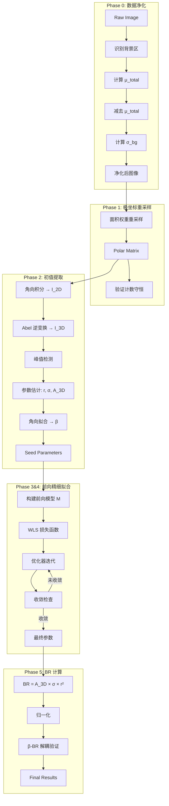

# Design Document: Abel Backward Reconstruction V3

## Overview

Abel 反演重建 V3 是一个用于 VMI（Velocity Map Imaging）光电子能谱数据分析的程序。它从 2D 投影图像中提取 3D 动量分布的物理参数，包括：
- 峰值位置 r_k（对应能量 E_k）
- 径向展宽 σ_k
- 角向各向异性参数 β_k
- 分支比 BR_k

### 核心设计原则

1. **预处理与建模分离**：Phase 0 只做减法（减去常数背景），Phase 3/4 的前向模型只做加法（不加回背景）
2. **物理正确性**：使用解析 Abel 投影公式，区分 σ_phys（参与投影）和 σ_sys（2D 卷积）
3. **统计正确性**：使用加权最小二乘法（WLS）处理减去均值后可能为负的数据
4. **参数解耦**：BR 计算必须与 β 解耦

## Architecture



## Components and Interfaces

### 关键设计决策

#### 1. 卷积域选择 (The Domain Decision)

**问题**：PSF 卷积在极坐标下是非平稳的（Non-stationary）。笛卡尔空间的圆形 PSF 在极坐标下会随 r 变化而畸变。

**解决方案**：采用 **选项 B - 笛卡尔域卷积**
- 前向模型在笛卡尔空间生成图像
- 在笛卡尔空间应用 PSF 卷积
- 转换到极坐标计算 Loss
- 这保证了 PSF 的物理正确性，虽然计算量稍大

#### 2. 梯度计算策略 (Gradient Strategy)

**问题**：高维非线性优化需要高效的梯度计算。

**解决方案**：
- 提供解析雅可比矩阵（Analytic Jacobian）
- 解析投影公式对 (r, σ, A, β) 的偏导数都是闭解
- 使用 scipy.optimize.least_squares 的 TRF 方法，支持 bounds 和解析雅可比

#### 3. 峰的生命周期管理 (Peak Lifecycle)

**问题**：SeedFinder 可能检测到假峰。

**解决方案**：
- 在迭代过程中剔除振幅 A < 0.05 × max(A) 的峰
- 使用 BIC/AIC 信息准则评估峰的显著性
- ReconstructionMetadata 记录每个峰的显著性水平

#### 4. 极坐标分辨率设定

**问题**：极坐标格点分辨率影响信息保真度。

**解决方案**：
- dr = 1.0 像素（与笛卡尔分辨率匹配）
- dθ = 2π/720 ≈ 0.5°（在 r=200 处，弧长 ≈ 1.7 像素，足够精细）
- 对于大 r，角向分辨率自动足够；对于小 r，使用 mask 区域

#### 5. r → 0 奇异性处理

**问题**：Abel 变换在 r ≈ 0 时数值不稳定。

**解决方案**：
- 定义 mask_radius = 15 像素
- r < mask_radius 区域不参与拟合
- 该区域假设各向同性或直接忽略

#### 6. 薄壳近似的适用范围 (Thin-Shell Approximation)

**问题**：解析投影公式 I_2D(R) ∝ A_3D × sqrt(r × σ) × exp(-(R-r)²/(2σ²)) 基于 r >> σ 的薄壳近似。

**物理分析**：
- 当 r/σ < 5 时，Abel 变换核 1/sqrt(r² - R²) 在 R → r 处的奇异性导致投影后的包络变得"左陡右缓"（非对称）
- 对称高斯近似会导致 r 估计偏小，σ 估计偏大

**解决方案**：
- 定义 thin_shell_threshold = 5
- 当 r/σ >= 5 时：使用高斯近似公式
- 当 r/σ < 5 时：切换到修正公式，包含偏斜校正项
  
  修正公式：I_2D(R) = A_3D × sqrt(r × σ) × exp(-(R-r)²/(2σ²)) × [1 + α × (R-r)/σ]
  
  其中 α = 0.15 × (5 - r/σ) 是经验偏斜校正系数

#### 7. β 投影修正因子 Correction(R) 的数学推导

**物理背景**：
3D 空间中的角向分布为 f(θ) = 1 + β × P2(cos θ)，其中 θ 是相对于极化轴的角度。
在 2D 投影面上的每一点 (R, φ)，实际接收到的是 3D 球壳沿 z 轴切片的所有贡献。

**数学推导**：
对于半径为 r 的球壳上的点，其 z 坐标范围为 [-sqrt(r² - R²), +sqrt(r² - R²)]。
设 z = r × cos(θ_3D)，则在投影面上 R 处的有效 β 权重为：

Correction(R) = ∫ P2(cos θ_3D) dz / ∫ dz

对于薄球壳（r >> σ），积分结果为：

**Correction(R) = (3R²/r² - 1) / 2 = P2(R/r)**

这意味着投影后的各向异性被"稀释"，有效 β 为：

**β_eff(R) = β × P2(R/r) = β × (3R²/r² - 1) / 2**

**完整投影公式**：
I_2D(R, φ) = A_3D × sqrt(r × σ) × exp(-(R-r)²/(2σ²)) × [1 + β × P2(R/r) × P2(cos φ)]

其中：
- P2(R/r) = (3R²/r² - 1) / 2 是几何修正因子
- P2(cos φ) = (3cos²φ - 1) / 2 是角向调制

**验证**：当 R = r 时，P2(R/r) = P2(1) = 1，恢复到 3D 的 β 值。

#### 8. IRLS 优化策略 (Iteratively Reweighted Least Squares)

**问题**：WLS 损失函数的分母 M 包含待优化参数，导致权重在优化过程中剧烈波动。

**解决方案**：采用 IRLS 策略
1. 初始化：使用 seed 参数计算初始模型 M_0
2. 外循环（权重更新）：
   - 固定权重 w = M_prev + σ_bg²
   - 内循环（参数优化）：最小化 Σ[(M - D)² / w]
   - 更新 M_prev = M_current
3. 收敛判断：当参数变化 < 1e-4 或达到最大迭代次数

**实现细节**：
- 外循环最大迭代次数：5
- 内循环使用 scipy.optimize.least_squares (TRF)
- 每次外循环后检查 Loss 是否下降

#### 9. 自动中心精修 (Auto-Centering Refinement)

**问题**：现实数据存在 0.1-0.5 像素的中心偏移，Abel 变换对中心极其敏感。

**解决方案**：在 Phase 0 增加中心精修步骤

**方法 A：基于对称性的 SVD 方法**
1. 计算图像的四象限
2. 通过最小化象限差异来优化中心

**方法 B：基于互相关的方法**
1. 将图像旋转 180°
2. 计算原图与旋转图的互相关
3. 互相关峰值位置的一半即为中心偏移

**实现选择**：采用方法 B，精度可达 0.1 像素

### 1. DataCleaner (Phase 0)

```python
class DataCleaner:
    """Phase 0: 数据净化模块"""
    
    def __init__(self, background_fraction: float = 0.15):
        """
        Args:
            background_fraction: 外围背景区占总半径的比例 (default 15%)
        """
        self.background_fraction = background_fraction
        self.mu_total = None
        self.sigma_bg = None
        self.variance_map = None  # 背景方差图
    
    def identify_background_region(self, image: np.ndarray) -> np.ndarray:
        """识别背景区域（外围 15% 半径）
        
        Returns:
            Boolean mask of background region
        """
        pass
    
    def clean(self, image: np.ndarray) -> Tuple[np.ndarray, float]:
        """执行数据净化
        
        1. 计算背景区均值 μ_total
        2. 减去 μ_total
        3. 计算背景区标准差 σ_bg
        4. 验证残差分布符合 N(0, σ_bg²)
        
        Returns:
            (净化后的图像, σ_bg)
        """
        pass
    
    def verify_cleaning(self, cleaned_image: np.ndarray) -> Dict[str, float]:
        """验证净化结果
        
        验收标准：背景区残差分布应符合 N(0, σ_bg²)
        
        Returns:
            {'bg_mean': float, 'bg_std': float, 'normality_pvalue': float, 'passed': bool}
        """
        pass
```

### 2. PolarTransformer (Phase 1)

```python
class PolarTransformer:
    """Phase 1: 极坐标重采样模块"""
    
    def __init__(self, n_theta: int = 720):
        """
        Args:
            n_theta: 角向分辨率（720 对应 0.5° 分辨率）
        """
        self.n_theta = n_theta
        self.theta_grid = None
    
    def transform(self, image: np.ndarray, center: Tuple[float, float] = None) -> np.ndarray:
        """笛卡尔 → 极坐标转换（面积权重）
        
        Args:
            image: 输入图像
            center: 图像中心 (cy, cx)，默认为几何中心
            
        Returns:
            Polar matrix (n_r, n_theta)
        """
        pass
    
    def inverse_transform(self, polar: np.ndarray, shape: Tuple[int, int]) -> np.ndarray:
        """极坐标 → 笛卡尔转换
        
        Returns:
            Cartesian image
        """
        pass
    
    def verify_conservation(self, cartesian: np.ndarray, polar: np.ndarray) -> Dict[str, float]:
        """验证计数守恒
        
        Returns:
            {'sum_cartesian': float, 'sum_polar': float, 'relative_error': float, 'passed': bool}
        """
        pass
```

### 3. SeedFinder (Phase 2)

```python
class SeedFinder:
    """Phase 2: 初值提取模块"""
    
    def __init__(self, mask_radius: int = 15):
        """
        Args:
            mask_radius: 中心遮罩半径（像素）
        """
        self.mask_radius = mask_radius
    
    def find_seeds(self, polar: np.ndarray, theta_grid: np.ndarray) -> List[Dict]:
        """提取峰值初始参数
        
        Returns:
            List of {'r': float, 'sigma': float, 'amp': float, 'beta': float}
        """
        pass
    
    def _angular_integrate(self, polar: np.ndarray) -> np.ndarray:
        """角向积分得到 I_2D(R)"""
        pass
    
    def _abel_inverse(self, profile_2d: np.ndarray) -> np.ndarray:
        """1D Abel 逆变换得到 I_3D(r)"""
        pass
    
    def _detect_peaks(self, profile_3d: np.ndarray) -> List[int]:
        """峰值检测"""
        pass
    
    def _estimate_sigma(self, profile: np.ndarray, r_center: int) -> float:
        """估计峰值宽度"""
        pass
    
    def _estimate_beta(self, polar: np.ndarray, r_center: int, theta_grid: np.ndarray) -> float:
        """估计角向参数"""
        pass
```

### 4. ForwardFitter (Phase 3 & 4)

```python
class ForwardFitter:
    """Phase 3 & 4: 前向精细拟合模块
    
    关键设计：
    - 在笛卡尔空间进行 PSF 卷积（保证物理正确性）
    - 提供解析雅可比矩阵（高效梯度计算）
    - 支持峰的动态剔除（生命周期管理）
    """
    
    def __init__(self, sigma_psf: float = 0.0, sigma_pixel: float = 0.4, 
                 sigma_interp: float = 0.55, lambda_reg: float = 0.01,
                 mask_radius: int = 15):
        """
        Args:
            sigma_psf: PSF 展宽（像素）
            sigma_pixel: 像素化展宽（像素）
            sigma_interp: 插值展宽（像素）
            lambda_reg: L1 正则化系数
            mask_radius: 中心遮罩半径（处理 r→0 奇异性）
        """
        self.sigma_sys = np.sqrt(sigma_psf**2 + sigma_pixel**2 + sigma_interp**2)
        self.lambda_reg = lambda_reg
        self.mask_radius = mask_radius
    
    def fit(self, data: np.ndarray, seeds: List[Dict], sigma_bg: float,
            use_analytic_jacobian: bool = True) -> Tuple[List[Dict], Dict]:
        """执行前向拟合
        
        Args:
            data: Phase 0 处理后的数据（可能含负值）
            seeds: Phase 2 提取的初始参数
            sigma_bg: 背景标准差（用于 WLS 权重）
            use_analytic_jacobian: 是否使用解析雅可比（推荐 True）
            
        Returns:
            (fitted_params, fit_metadata)
            fit_metadata 包含 BIC/AIC 信息准则
        """
        pass
    
    def _forward_model_cartesian(self, params: np.ndarray, shape: Tuple[int, int]) -> np.ndarray:
        """在笛卡尔空间构建前向模型
        
        流程：
        1. 生成 3D 分布的 2D 切片（解析投影）
        2. 在笛卡尔空间应用 PSF 卷积
        3. 返回笛卡尔图像
        """
        pass
    
    def _analytic_abel_with_beta(self, R: np.ndarray, theta: np.ndarray,
                                  r: float, sigma: float, amp: float, beta: float) -> np.ndarray:
        """考虑 β 的解析 Abel 投影公式
        
        物理事实：3D 球壳在 P2 对称性下的投影，其 2D 图像的表观 β_2D 会发生几何缩放。
        
        完整公式：
        I_2D(R, θ) = A_3D × sqrt(r × σ) × exp(-(R-r)²/(2σ²)) × [1 + β_eff × P2(cos θ)]
        
        其中 β_eff 是考虑投影几何后的有效 β 值。
        对于薄球壳：β_eff ≈ β × (1 - σ²/(2r²))（一阶近似）
        """
        pass
    
    def _analytic_jacobian(self, params: np.ndarray, data: np.ndarray, 
                           sigma_bg: float) -> np.ndarray:
        """解析雅可比矩阵
        
        对每个参数 (r_k, σ_k, A_k, β_k) 计算 Loss 的偏导数。
        
        ∂Loss/∂r_k = Σ 2(M-D)/w × ∂M/∂r_k
        ∂Loss/∂σ_k = Σ 2(M-D)/w × ∂M/∂σ_k
        ∂Loss/∂A_k = Σ 2(M-D)/w × ∂M/∂A_k + λ × sign(A_k)
        ∂Loss/∂β_k = Σ 2(M-D)/w × ∂M/∂β_k
        
        其中 w = M + σ_bg²
        """
        pass
    
    def _wls_loss(self, params: np.ndarray, data: np.ndarray, sigma_bg: float) -> float:
        """加权最小二乘损失函数
        
        Loss = Σ[(M_xy - D_xy)² / (M_xy + σ_bg²)] + λ Σ|A_k|
        
        注意：M_xy 可能为负（在边缘区域），使用 max(M_xy, ε) 保证数值稳定
        """
        pass
    
    def _prune_weak_peaks(self, params: List[Dict], threshold: float = 0.05) -> List[Dict]:
        """剔除弱峰
        
        剔除 A < threshold × max(A) 的峰
        """
        pass
    
    def compute_information_criteria(self, data: np.ndarray, model: np.ndarray,
                                      n_params: int, sigma_bg: float) -> Dict[str, float]:
        """计算信息准则
        
        Returns:
            {'BIC': float, 'AIC': float, 'reduced_chi2': float}
        """
        pass
    
    def verify_residual(self, data: np.ndarray, model: np.ndarray) -> Dict[str, float]:
        """验证残差
        
        Returns:
            {'max_residual': float, 'ring_structure_detected': bool}
        """
        pass
```

### 5. BRCalculator (Phase 5)

```python
class BRCalculator:
    """Phase 5: Branching Ratio 计算模块"""
    
    def calculate(self, params: List[Dict]) -> List[Dict]:
        """计算并归一化 BR
        
        BR_k = A_3D_k × σ_phys_k × r_k²
        
        Returns:
            params with 'br' field added
        """
        pass
    
    def verify_decoupling(self, fitter: ForwardFitter, data: np.ndarray, 
                          seeds: List[Dict], sigma_bg: float, 
                          beta_perturbation: float = 0.5) -> Dict[str, Any]:
        """验证 β-BR 解耦
        
        改变 β 初值重新拟合，检查 BR 是否保持不变
        
        Returns:
            {'br_original': List, 'br_perturbed': List, 'max_deviation': float, 'passed': bool}
        """
        pass
```

### 6. AbelReconstructorV3 (主类)

```python
class AbelReconstructorV3:
    """Abel 反演重建 V3 主类"""
    
    def __init__(self, config: Optional[Config] = None):
        """
        Args:
            config: VMI 配置参数
        """
        self.cleaner = DataCleaner()
        self.transformer = PolarTransformer()
        self.seed_finder = SeedFinder()
        self.fitter = ForwardFitter()
        self.br_calculator = BRCalculator()
        self.config = config
    
    def reconstruct(self, image: np.ndarray, verbose: bool = True) -> Tuple[List[Dict], Dict]:
        """执行完整重建流程
        
        Returns:
            (params, metadata)
        """
        pass
    
    def run_all_tests(self, image: np.ndarray) -> Dict[str, Dict]:
        """运行所有验证测试
        
        Returns:
            {'test_0_1': {...}, 'test_0_2': {...}, ...}
        """
        pass
```

## Data Models

### Peak Parameters

```python
@dataclass
class PeakParams:
    """单个峰值的参数"""
    r: float              # 峰值位置（像素）
    sigma_phys: float     # 物理展宽（参与投影）
    sigma_measured: float # 测量展宽（包含系统展宽）
    amp: float            # 3D 振幅 A_3D
    beta: float           # 角向参数 β ∈ [-1, 2]
    br: float             # 分支比（归一化后）
    energy_eV: float      # 能量（eV，如果有校准）
    fwhm: float           # 半高全宽 = 2.355 × σ
```

### Reconstruction Metadata

```python
@dataclass
class ReconstructionMetadata:
    """重建元数据"""
    # Phase 0
    mu_total: float       # 背景均值
    sigma_bg: float       # 背景标准差
    bg_normality_pvalue: float  # 背景残差正态性检验 p-value
    
    # Phase 1
    sum_cartesian: float  # 笛卡尔图像总和
    sum_polar: float      # 极坐标图像总和
    conservation_error: float  # 守恒误差
    
    # Phase 2
    n_seeds: int          # 检测到的峰值数
    
    # Phase 3/4
    final_loss: float     # 最终损失值
    n_iterations: int     # 迭代次数
    converged: bool       # 是否收敛
    bic: float            # 贝叶斯信息准则
    aic: float            # 赤池信息准则
    reduced_chi2: float   # 约化卡方
    
    # Phase 5
    br_decoupling_passed: bool  # β-BR 解耦测试是否通过
    br_decoupling_max_deviation: float  # β-BR 解耦最大偏差
    
    # 系统参数
    sigma_psf: float
    sigma_pixel: float
    sigma_interp: float
    sigma_sys: float      # 总系统展宽
    
    # 峰显著性
    peak_significance: List[Dict]  # 每个峰的 {'peak_id': int, 'bic_contribution': float, 'significant': bool}
```

## Correctness Properties

*A property is a characteristic or behavior that should hold true across all valid executions of a system-essentially, a formal statement about what the system should do. Properties serve as the bridge between human-readable specifications and machine-verifiable correctness guarantees.*

### Property 1: Background Region Mean Zero After Cleaning

*For any* VMI image with non-zero background, after Phase 0 cleaning, the mean of the background region (outer 15% radius) SHALL equal zero within tolerance 1e-6.

**Validates: Requirements 1.4**

### Property 2: Sum Conservation in Polar Transform

*For any* 2D image, after converting from Cartesian to polar coordinates using area-weighted resampling, the total sum SHALL be preserved: |sum(Cartesian) - sum(Polar)| / sum(Cartesian) < 1e-6.

**Validates: Requirements 2.2**

### Property 3: Abel Transform Round-Trip

*For any* 1D radial profile, applying forward Abel transform followed by inverse Abel transform SHALL recover the original profile within numerical tolerance.

**Validates: Requirements 3.2**

### Property 4: Peak Parameter Extraction Accuracy

*For any* synthetic image with known peak parameters (r, σ, A_3D, β), the seed finder SHALL extract parameters within 5% relative error for r and σ, and within 0.1 absolute error for β.

**Validates: Requirements 3.4, 3.5, 3.6, 3.7**

### Property 5: Forward Model Consistency

*For any* set of peak parameters, the forward model output SHALL match numerical Abel integration within 1% relative error.

**Validates: Requirements 4.1, 7.1**

### Property 6: Non-Negative Amplitude Constraint

*For any* fitting result, all A_3D values SHALL be non-negative (A_3D >= 0).

**Validates: Requirements 4.8**

### Property 7: Sub-Pixel Position Precision

*For any* fitting result, peak positions r SHALL be floating-point values (not constrained to integers).

**Validates: Requirements 4.9**

### Property 8: BR Normalization

*For any* set of computed branching ratios, the sum SHALL equal 1.0 within tolerance 1e-6.

**Validates: Requirements 5.5**

### Property 9: β-BR Decoupling (Critical)

*For any* dataset, when β initial values are perturbed by ±0.5 and refitting is performed, the resulting BR values SHALL remain within 1% of the original BR values.

**详细测试用例**：
- 构造三个合成图像：(A=1, β=0), (A=1, β=1), (A=1, β=2)
- 验收标准：BRCalculator 算出的总粒子数 N 在这三个用例中，偏差必须小于 0.5%
- 如果做不到，说明投影公式中没有正确处理各向异性项的面积分

**Validates: Requirements 5.3**

### Property 10: Negative Value Preservation

*For any* image where background subtraction produces negative values, those negative values SHALL be preserved in the cleaned image (no clipping to zero).

**Validates: Requirements 1.6**

### Property 11: Legendre Polynomial Correctness

*For any* value x ∈ [-1, 1], the computed P2(x) SHALL equal (3x² - 1) / 2 within floating-point precision.

**Validates: Requirements 7.5**

### Property 12: Energy Linearity (Jacobian Verification)

*For any* two peaks with known energy ratio E1:E2 = 1:4, the fitted radius ratio SHALL satisfy r1:r2 = 1:2 within 0.5% tolerance.

**Validates: Requirements 7.1 (coordinate transform linearity)**

### Property 13: β-Invariant Total Count

*For any* synthetic image with fixed A_3D and varying β ∈ {0, 1, 2}, the computed total particle count N = Σ(A_3D_k × σ_k × r_k²) SHALL remain constant within 0.5% tolerance.

**Validates: Requirements 5.3 (projection formula correctness)**

## Critical Finding: Forward Fitting Limitations (V3 Post-Mortem)

### 问题诊断

经过严格的物理审查，V3 的前向拟合模块存在以下根本性问题：

#### 1. 形状不匹配（The Shape Mismatch）- 致命伤

**代码逻辑**：`_analytic_abel_with_beta` 使用 `exp(-(R-r)²/(2σ²))` 作为 2D 投影形状。

**物理错误**：3D 高斯球壳 $P(r) = A \cdot \exp(-(r-r_0)^2/2\sigma^2)$ 投影到 2D 平面后的数学形式是 Abel 积分：

$$I_{2D}(R) = \int_R^\infty \frac{2 \cdot P(r) \cdot r}{\sqrt{r^2 - R^2}} dr$$

这个积分的结果在 $R=r_0$ 附近表现为一个**极度非对称**的曲线：
- 内侧（$R < r_0$）：由于 $1/\sqrt{r^2-R^2}$ 的奇点特征，下降极快
- 外侧（$R > r_0$）：由于高斯尾部，下降较慢

**后果**：用对称高斯拟合非对称投影，优化器会：
- 把峰中心 $r$ 往里推（向小半径移动）
- 把 $\sigma$ 放大以覆盖非对称拖尾
- 最终参数偏离真值

#### 2. β-Amplitude 耦合

**问题**：角向分布 $1 + \beta P_2(\cos \theta)$ 在 3D 空间积分守恒，但在 2D 投影面上，不同 $\beta$ 下的总强度**不守恒**。

**后果**：调整 $\beta$ 会改变 2D 图像总计数，导致 $\beta$ 和 $A_{3D}$ 深度耦合。

#### 3. WLS 信号排斥

**问题**：权重 `w = 1/sqrt(|M| + σ_bg²)` 在迭代过程中产生负反馈：
- 模型峰偏离实验峰时，错误位置权重变小
- 正确位置（模型为 0）权重反而很大
- 优化器被"排斥"离开正确位置

### 结论

**Phase 2（Hansen-Law Abel 逆变换）比 Phase 4（前向拟合）更准确**，因为：
- Hansen-Law 方法不依赖形状假设
- 直接从数据提取信息，不受模型偏差影响

### V4 路线图：数值投影模板

如果要让前向拟合真正超越逆变换，必须放弃"全解析"幻想，改用**数值投影模板**：

1. **预计算投影核（Kernel-based Fitting）**：
   - 预计算标准 1D Abel 投影模板（3D 高斯球壳的精确数值 Abel 变换）
   - 拟合时通过线性插值平移和缩放这个**真实形状**

2. **两步精修策略**：
   - Step A：对角向积分后的 1D 径向曲线进行拟合，使用非对称 Abel 投影核
   - Step B：固定 $r$ 和 $\sigma$，通过 2D 图像角分布 FFT 提取 $\beta$
   - Step C：极坐标下全参数联合优化

3. **归一化角向贡献**：
   ```python
   # 强制归一化，避免 beta 和 amp 耦合
   angular_term = (R_over_r_sq * P2_cos_phi + (1.0/3.0) * P2_R_r)
   angular = 1.0 + beta * angular_term  # 1.0 必须是投影守恒项
   ```

4. **中心坐标作为参数**：将 `center_offset` 放入待拟合参数向量

### 当前推荐配置

在 V4 实现之前，推荐使用：
```python
reconstructor.reconstruct(image, skip_forward_fit=True, use_polar_fit=False)
```

这将使用 Phase 2 的 Abel 逆变换结果，配合 β 校正因子计算 BR。

## Error Handling

### Input Validation Errors

| Error Condition | Handling |
|----------------|----------|
| Image is None or empty | Raise ValueError with descriptive message |
| Image is not 2D | Raise ValueError |
| Image has non-square shape | Raise ValueError |
| Image has all-zero values | Return empty results with warning |
| Image has NaN or Inf values | Replace with 0 and log warning |

### Numerical Stability Errors

| Error Condition | Handling |
|----------------|----------|
| Division by zero | Add epsilon (1e-10) to denominator |
| Exponential overflow | Clip argument to [-700, 700] |
| Negative sqrt argument | Use max(0, x) before sqrt |
| Optimizer non-convergence | Return best result with warning flag |

### Physical Constraint Violations

| Error Condition | Handling |
|----------------|----------|
| β outside [-1, 2] | Clip to valid range |
| Negative amplitude | Set to 0 |
| σ < 0.3 pixels | Set to minimum 0.3 |
| r < mask_radius | Exclude peak |

## Testing Strategy

### Dual Testing Approach

本项目采用单元测试和属性测试相结合的方法：

1. **单元测试**：验证特定示例和边界情况
2. **属性测试**：验证在所有有效输入上都应成立的通用属性

### Property-Based Testing Framework

使用 **Hypothesis** 库进行属性测试。

```python
from hypothesis import given, strategies as st, settings

# 配置：每个属性测试运行至少 100 次迭代
@settings(max_examples=100)
```

### Test Categories

#### Phase 0 Tests
- Test 0.1: 背景区均值为零
- Test 0.2: 背景标准差符合噪声模型

#### Phase 1 Tests
- Test 1.1: 计数守恒
- Test 1.2: 单像素映射测试

#### Phase 2 Tests
- Test 2.1: Seed 参数覆盖实验曲线

#### Phase 3/4 Tests
- Test 4.1: 残差平坦性
- Test 4.2: 假峰抑制

#### Phase 5 Tests
- Test 5.1: β-BR 解耦

#### Integration Tests
- 完整流程测试：与真值对比，计算百分比误差
- 格式参考 test_v2_percent_error.py

### Property Test Annotations

每个属性测试必须包含以下注释格式：

```python
def test_property_name():
    """
    **Feature: abel-backward-v3, Property N: Property description**
    **Validates: Requirements X.Y**
    """
    pass
```
