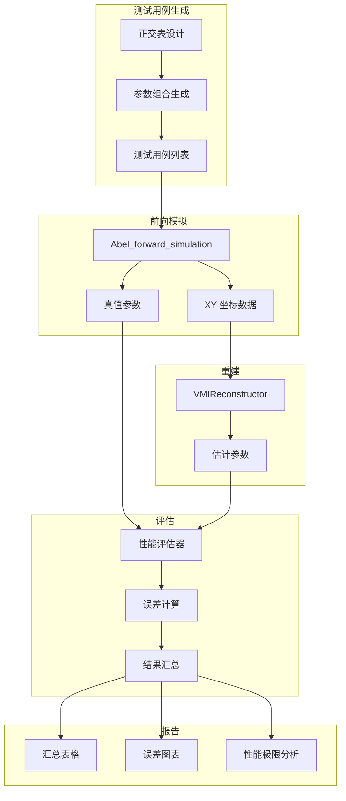

# Design Document: VMI Algorithm Testing and Improvement Framework

## Overview

本设计文档描述了一个综合测试框架，用于系统性评估和改进 VMI 重建算法 (`vmi_reconstruction.py`)。框架包含：

1. **正交测试用例生成器**：基于正交表设计，高效覆盖参数空间
2. **前向模拟接口**：使用 `Abel_forward_simulation.py` 生成已知真值的测试数据
3. **性能评估器**：计算各参数与真值的百分比偏差
4. **改进算法**：自动参数调整，减少人工干预
5. **测试报告生成器**：生成详细的性能报告

### 核心设计原则

1. **正交设计**：使用 L27(3^13) 或类似正交表，以最少测试覆盖最多参数组合
2. **定量评估**：所有性能指标都有明确的数值定义
3. **自动化**：从测试生成到报告输出全流程自动化
4. **可扩展**：易于添加新的测试因子或评估指标

## Architecture



## Components and Interfaces

### 1. OrthogonalTestDesigner (正交测试设计器)

```python
class OrthogonalTestDesigner:
    """正交测试设计器
    
    使用正交表设计测试用例，高效覆盖参数空间。
    """
    
    # 测试因子定义
    FACTORS = {
        'n_peaks': [1, 2, 3],                    # 峰数量
        'event_count': [1e4, 1e6, 1e9],          # 事件数
        'peak_separation': ['well', 'moderate', 'overlap'],  # 峰分离度
        'beta_range': ['negative', 'zero', 'positive'],      # β 范围
        'amplitude_ratio': ['equal', '10:1', '100:1'],       # 振幅比
        'sigma_range': ['narrow', 'medium', 'wide'],         # σ 范围
        'r_position': ['inner', 'middle', 'outer'],          # 径向位置
        'noise_level': ['clean', 'low', 'high'],             # 噪声水平
    }
    
    def __init__(self, factors: dict = None):
        """
        Args:
            factors: 自定义因子定义，默认使用 FACTORS
        """
        self.factors = factors or self.FACTORS
    
    def generate_orthogonal_array(self) -> np.ndarray:
        """生成正交表
        
        Returns:
            正交表矩阵，每行是一个测试用例的因子水平索引
        """
        pass
    
    def generate_test_cases(self) -> List[dict]:
        """生成测试用例列表
        
        Returns:
            测试用例列表，每个用例包含所有参数的具体值
        """
        pass
    
    def add_corner_cases(self, test_cases: List[dict]) -> List[dict]:
        """添加角落用例（极端条件）
        
        Returns:
            包含角落用例的完整测试列表
        """
        pass
```

### 2. TestCaseGenerator (测试用例生成器)

```python
class TestCaseGenerator:
    """测试用例生成器
    
    将正交设计转换为具体的模拟参数。
    """
    
    # 参数映射
    SIGMA_MAP = {'narrow': 0.1, 'medium': 0.5, 'wide': 2.0}
    R_POSITION_MAP = {'inner': (2, 5), 'middle': (8, 12), 'outer': (15, 20)}
    
    def __init__(self, vmi_k: float = None, r_max: float = 20.0):
        """
        Args:
            vmi_k: VMI 校准系数，默认自动计算
            r_max: 最大半径 (mm)
        """
        self.r_max = r_max
        self.vmi_k = vmi_k
    
    def generate_config(self, test_case: dict) -> Config:
        """将测试用例转换为 Config 对象
        
        Args:
            test_case: 正交设计生成的测试用例
            
        Returns:
            Abel_forward_simulation.Config 对象
        """
        pass
    
    def _generate_peak_positions(self, n_peaks: int, r_position: str, 
                                  separation: str, sigma: float) -> List[float]:
        """生成峰位置
        
        根据峰数量、位置区域、分离度生成具体的 r0 值。
        """
        pass
    
    def _generate_betas(self, n_peaks: int, beta_range: str) -> List[float]:
        """生成 β 值
        
        根据 β 范围生成具体的 β 值。
        """
        pass
    
    def _generate_amplitudes(self, n_peaks: int, ratio: str) -> List[float]:
        """生成振幅（分支比）
        
        根据振幅比生成归一化的分支比。
        """
        pass
```

### 3. SimulationRunner (模拟运行器)

```python
class SimulationRunner:
    """模拟运行器
    
    使用 Abel_forward_simulation 生成测试数据。
    
    重要：默认使用 output_mode='xy_dld' 生成带噪声的 XY 数据，
    包含 PSF 展宽和 DLD 量化效应，模拟真实探测器输出。
    """
    
    def __init__(self, add_noise: bool = True):
        """
        Args:
            add_noise: 是否添加噪声（PSF + DLD 量化），默认 True
        """
        self.add_noise = add_noise
    
    def run(self, config: Config) -> Tuple[np.ndarray, dict]:
        """运行模拟
        
        Args:
            config: 模拟配置
            
        Returns:
            (xy_data, ground_truth)
            - xy_data: (N, 2) XY 坐标（带 PSF 和 DLD 噪声）
            - ground_truth: 真值参数字典
            
        Note:
            使用 output_mode='xy_dld' 生成模拟 DLD 输出：
            - PSF 展宽（MCP + 延迟线的空间分辨率）
            - DLD 数字化量化（TDC 时间分辨率 → 位置精度）
        """
        pass
    
    def run_batch(self, configs: List[Config], 
                  progress_callback: callable = None) -> List[Tuple[np.ndarray, dict]]:
        """批量运行模拟
        
        Args:
            configs: 配置列表
            progress_callback: 进度回调函数
            
        Returns:
            结果列表
        """
        pass
```

### 4. PerformanceEvaluator (性能评估器)

```python
class PerformanceEvaluator:
    """性能评估器
    
    计算重建结果与真值的偏差。
    """
    
    def __init__(self, tolerance_r0: float = 0.05, 
                 tolerance_sigma: float = 0.10,
                 tolerance_beta: float = 0.2):
        """
        Args:
            tolerance_r0: r0 容差（相对误差）
            tolerance_sigma: σ 容差（相对误差）
            tolerance_beta: β 容差（绝对误差）
        """
        self.tolerance_r0 = tolerance_r0
        self.tolerance_sigma = tolerance_sigma
        self.tolerance_beta = tolerance_beta
    
    def evaluate(self, estimated: List[PeakResult], 
                 ground_truth: dict) -> dict:
        """评估单个测试用例
        
        Args:
            estimated: 重建结果
            ground_truth: 真值参数
            
        Returns:
            评估结果字典，包含各参数的误差
        """
        pass
    
    def _match_peaks(self, estimated: List[PeakResult], 
                     true_r0s: List[float]) -> List[Tuple[int, int]]:
        """匹配估计峰与真实峰
        
        使用最近邻匹配。
        
        Returns:
            匹配对列表 [(est_idx, true_idx), ...]
        """
        pass
    
    def compute_errors(self, estimated: PeakResult, 
                       true_params: dict) -> dict:
        """计算单个峰的误差
        
        Returns:
            {'r0_error': float, 'sigma_error': float, 'beta_error': float}
        """
        pass
    
    def aggregate_results(self, all_results: List[dict]) -> dict:
        """汇总所有测试结果
        
        Returns:
            汇总统计：mean, median, std, worst_case, pass_rate
        """
        pass
```

### 5. ImprovedVMIReconstructor (改进的 VMI 重建器)

```python
class ImprovedVMIReconstructor:
    """改进的 VMI 重建器
    
    关键改进：
    1. 自动检测峰数量
    2. 自适应 bin 大小
    3. 自动 SNR 阈值调整
    4. 处理极端条件
    """
    
    def __init__(self, xy_data: np.ndarray):
        """
        Args:
            xy_data: (N, 2) XY 坐标数据
        """
        self.xy_data = xy_data
        self.n_events = len(xy_data)
        
        # 自动计算参数
        self._auto_center()
        self._auto_bin_size()
        self._auto_snr_threshold()
    
    def _auto_center(self):
        """自动中心检测
        
        使用迭代质心法或互相关法。
        """
        pass
    
    def _auto_bin_size(self):
        """自动 bin 大小
        
        基于数据密度和 r_max 自动选择最优 dr。
        规则：确保每个 bin 至少有 ~100 个事件。
        """
        pass
    
    def _auto_snr_threshold(self):
        """自动 SNR 阈值
        
        基于背景噪声水平自动设置峰检测阈值。
        """
        pass
    
    def _auto_detect_n_peaks(self) -> int:
        """自动检测峰数量
        
        使用多尺度分析和 BIC/AIC 准则。
        """
        pass
    
    def reconstruct(self, n_peaks: int = None, 
                    verbose: bool = True) -> List[PeakResult]:
        """执行重建
        
        Args:
            n_peaks: 峰数量，None 表示自动检测
            verbose: 是否打印详细信息
            
        Returns:
            重建结果列表
        """
        pass
    
    def _handle_overlapping_peaks(self, peaks: List[dict]) -> List[dict]:
        """处理重叠峰
        
        使用多峰联合拟合。
        """
        pass
    
    def _handle_low_statistics(self):
        """处理低统计量情况
        
        使用自适应 binning 或 KDE。
        """
        pass
    
    def _handle_high_statistics(self):
        """处理高统计量情况
        
        使用分块处理避免内存问题。
        """
        pass
```

### 6. TestReporter (测试报告生成器)

```python
class TestReporter:
    """测试报告生成器"""
    
    def __init__(self, results: List[dict], test_cases: List[dict]):
        """
        Args:
            results: 评估结果列表
            test_cases: 测试用例列表
        """
        self.results = results
        self.test_cases = test_cases
    
    def generate_summary_table(self) -> pd.DataFrame:
        """生成汇总表格"""
        pass
    
    def generate_error_plots(self, save_dir: str = None):
        """生成误差图表
        
        - 误差 vs 事件数
        - 误差 vs 峰分离度
        - 误差 vs β 值
        - 误差 vs 径向位置
        """
        pass
    
    def identify_failure_conditions(self) -> List[dict]:
        """识别失败条件
        
        找出误差超过容差的测试用例。
        """
        pass
    
    def compute_pass_rate(self) -> dict:
        """计算通过率
        
        Returns:
            {'r0_pass_rate': float, 'sigma_pass_rate': float, 'beta_pass_rate': float, 'overall': float}
        """
        pass
    
    def save_results(self, filepath: str):
        """保存结果到文件
        
        支持 JSON 和 CSV 格式。
        """
        pass
    
    def compare_algorithms(self, other_results: List[dict]) -> dict:
        """比较两个算法版本
        
        Returns:
            改进指标
        """
        pass
```

## Data Models

### TestCase (测试用例)

```python
@dataclass
class TestCase:
    """测试用例"""
    case_id: str                    # 用例 ID
    n_peaks: int                    # 峰数量
    event_count: int                # 事件数
    peak_separation: str            # 峰分离度
    beta_range: str                 # β 范围
    amplitude_ratio: str            # 振幅比
    sigma_range: str                # σ 范围
    r_position: str                 # 径向位置
    noise_level: str                # 噪声水平
    
    # 具体参数值
    E_centers: List[float]          # 能量中心 (eV)
    r0_values: List[float]          # 半径位置 (mm)
    sigma_values: List[float]       # 峰宽 (mm)
    beta_values: List[float]        # β 值
    branching_ratios: List[float]   # 分支比
```

### EvaluationResult (评估结果)

```python
@dataclass
class EvaluationResult:
    """评估结果"""
    case_id: str                    # 用例 ID
    
    # 峰匹配
    n_true_peaks: int               # 真实峰数
    n_detected_peaks: int           # 检测到的峰数
    n_matched_peaks: int            # 匹配的峰数
    n_missed_peaks: int             # 漏检的峰数
    n_false_positives: int          # 误检的峰数
    
    # 误差（每个匹配峰）
    r0_errors: List[float]          # r0 相对误差 (%)
    sigma_errors: List[float]       # σ 相对误差 (%)
    beta_errors: List[float]        # β 绝对误差
    amp_errors: List[float]         # 振幅相对误差 (%)
    
    # 汇总
    mean_r0_error: float
    mean_sigma_error: float
    mean_beta_error: float
    passed: bool                    # 是否通过
```

### TestSummary (测试汇总)

```python
@dataclass
class TestSummary:
    """测试汇总"""
    total_cases: int                # 总测试数
    passed_cases: int               # 通过数
    failed_cases: int               # 失败数
    
    # 按因子分组的通过率
    pass_rate_by_event_count: dict
    pass_rate_by_separation: dict
    pass_rate_by_beta: dict
    pass_rate_by_r_position: dict
    
    # 误差统计
    r0_error_stats: dict            # mean, median, std, max
    sigma_error_stats: dict
    beta_error_stats: dict
    
    # 性能极限
    min_event_count_for_5pct: int   # 达到 5% 误差所需最小事件数
    min_separation_for_5pct: float  # 达到 5% 误差所需最小分离度
```


## Correctness Properties

*A property is a characteristic or behavior that should hold true across all valid executions of a system-essentially, a formal statement about what the system should do. Properties serve as the bridge between human-readable specifications and machine-verifiable correctness guarantees.*

### Property 1: Test Case Generation Validity

*For any* generated test case, all parameters SHALL be within valid ranges:
- n_peaks ∈ [1, 5]
- event_count ∈ [1e4, 1e9]
- β ∈ [-1, 2]
- σ > 0
- r0 > 0 and r0 < r_max
- branching_ratios sum to 1.0

**Validates: Requirements 1.1, 1.2, 1.5, 1.6, 1.10**

### Property 2: Peak Separation Consistency

*For any* multi-peak test case with "well-separated" designation, all adjacent peaks SHALL have separation > 5σ. *For any* test case with "overlapping" designation, at least one pair of adjacent peaks SHALL have separation < 2σ.

**Validates: Requirements 1.3, 1.4**

### Property 3: Radial Position Coverage

*For any* test case with "inner" position, all r0 values SHALL be < 5mm. *For any* test case with "outer" position, all r0 values SHALL be > 15mm. *For any* test case with "middle" position, all r0 values SHALL be in [5mm, 15mm].

**Validates: Requirements 1.11, 1.12, 1.13**

### Property 4: Orthogonal Array Balance

*For any* orthogonal test design, each factor level SHALL appear with equal frequency across the test suite, and all 2-factor combinations SHALL be covered.

**Validates: Requirements 7.2, 7.3**

### Property 5: Simulation Round-Trip Consistency

*For any* simulation configuration, the ground truth parameters returned by the simulator SHALL exactly match the input configuration parameters.

**Validates: Requirements 2.2, 2.4**

### Property 6: Energy-Radius Conversion Consistency

*For any* energy E and VMI calibration k, the radius r = k × sqrt(2E/m) SHALL be consistent between simulation and reconstruction.

**Validates: Requirements 2.6**

### Property 7: Error Calculation Correctness

*For any* pair of estimated and true parameters:
- r0_error = |r0_est - r0_true| / r0_true × 100%
- σ_error = |σ_est - σ_true| / σ_true × 100%
- β_error = |β_est - β_true|

**Validates: Requirements 3.1, 3.2, 3.3, 3.4**

### Property 8: Peak Matching Correctness

*For any* set of estimated peaks and true peaks, the matching algorithm SHALL minimize total r0 distance, and each true peak SHALL be matched to at most one estimated peak.

**Validates: Requirements 3.5**

### Property 9: Auto-Detection Accuracy

*For any* test case with well-separated peaks and event_count >= 1e5, the auto-detected peak count SHALL equal the true peak count.

**Validates: Requirements 4.1**

### Property 10: Adaptive Binning Correctness

*For any* dataset, the auto-selected bin size dr SHALL ensure each bin has at least ~100 events on average (for r > 5mm).

**Validates: Requirements 4.2, 5.2**

### Property 11: Reconstruction Accuracy Under Standard Conditions

*For any* test case with:
- event_count >= 1e6
- well-separated peaks
- β ∈ [0, 1]
- σ ∈ [0.3, 1.0]
- r0 ∈ [5, 15] mm

The reconstruction SHALL achieve:
- r0 error < 2%
- σ error < 10%
- β error < 0.1

**Validates: Requirements 4.4, 4.6**

### Property 12: Robustness Under Extreme Conditions

*For any* test case with extreme conditions (β = -1 or 2, σ < 0.1 or > 2.0, r0 near edge), the reconstruction SHALL:
- Not crash
- Return finite values
- Achieve r0 error < 10%

**Validates: Requirements 5.4, 5.6, 5.7, 5.8**

### Property 13: Overlapping Peak Resolution

*For any* test case with overlapping peaks (separation < 2σ), the reconstruction SHALL detect the correct number of peaks with r0 error < 5% for each peak.

**Validates: Requirements 5.1**

### Property 14: Weak Peak Detection

*For any* test case with amplitude ratio 100:1, the reconstruction SHALL detect the weak peak with r0 error < 10%.

**Validates: Requirements 5.5**

### Property 15: Numerical Stability

*For any* input data (including edge cases with very few or very many events), the algorithm SHALL:
- Not raise division by zero errors
- Not raise overflow errors
- Not raise negative sqrt errors
- Complete within reasonable time

**Validates: Requirements 8.1, 8.2, 8.3, 8.4, 8.5**

### Property 16: Pass Rate Calculation Correctness

*For any* set of test results, the pass rate SHALL equal (number of tests within tolerance) / (total tests) × 100%.

**Validates: Requirements 6.5**

## Error Handling

### Input Validation Errors

| Error Condition | Handling |
|----------------|----------|
| xy_data is None or empty | Raise ValueError with descriptive message |
| xy_data is not 2D with shape (N, 2) | Raise ValueError |
| xy_data contains NaN or Inf | Remove invalid points and log warning |
| n_peaks <= 0 | Raise ValueError |
| event_count < 100 | Log warning, proceed with adaptive binning |

### Numerical Stability Errors

| Error Condition | Handling |
|----------------|----------|
| Division by zero in density calculation | Add epsilon (1e-10) to denominator |
| Exponential overflow in Gaussian | Clip argument to [-700, 700] |
| Negative sqrt argument | Use max(0, x) before sqrt |
| Memory overflow with large datasets | Use chunked processing |

### Algorithm Convergence Errors

| Error Condition | Handling |
|----------------|----------|
| Optimizer non-convergence | Return best result with warning flag |
| No peaks detected | Return empty list with warning |
| Peak count mismatch | Log warning, return detected peaks |

## Testing Strategy

### Dual Testing Approach

本项目采用单元测试和属性测试相结合的方法：

1. **单元测试**：验证特定示例和边界情况
2. **属性测试**：验证在所有有效输入上都应成立的通用属性

### Property-Based Testing Framework

使用 **Hypothesis** 库进行属性测试。

```python
from hypothesis import given, strategies as st, settings

# 配置：每个属性测试运行至少 100 次迭代
@settings(max_examples=100)
```

### Test Categories

#### Test Case Generation Tests
- Test 1.1: 单峰配置有效性
- Test 1.2: 多峰配置有效性
- Test 1.3: 峰分离度正确性
- Test 1.4: 正交表平衡性

#### Simulation Tests
- Test 2.1: 模拟输出格式正确性
- Test 2.2: 真值参数一致性
- Test 2.3: 能量-半径转换一致性

#### Evaluation Tests
- Test 3.1: 误差计算正确性
- Test 3.2: 峰匹配正确性
- Test 3.3: 汇总统计正确性

#### Algorithm Tests
- Test 4.1: 标准条件下的重建精度
- Test 4.2: 极端条件下的鲁棒性
- Test 4.3: 重叠峰分辨能力
- Test 4.4: 弱峰检测能力
- Test 4.5: 数值稳定性

#### Integration Tests
- Test 5.1: 完整流程测试（生成 → 模拟 → 重建 → 评估）
- Test 5.2: 批量测试执行
- Test 5.3: 报告生成

### Property Test Annotations

每个属性测试必须包含以下注释格式：

```python
def test_property_name():
    """
    **Feature: vmi-algorithm-testing, Property N: Property description**
    **Validates: Requirements X.Y**
    """
    pass
```

### Performance Benchmarks

| Condition | Target r0 Error | Target σ Error | Target β Error |
|-----------|-----------------|----------------|----------------|
| Standard (1e6 events, well-separated) | < 2% | < 10% | < 0.1 |
| Low statistics (1e4 events) | < 5% | < 20% | < 0.2 |
| High statistics (1e9 events) | < 1% | < 5% | < 0.05 |
| Overlapping peaks | < 5% | < 15% | < 0.15 |
| Extreme β | < 3% | < 10% | < 0.15 |
| Edge positions | < 5% | < 15% | < 0.2 |

