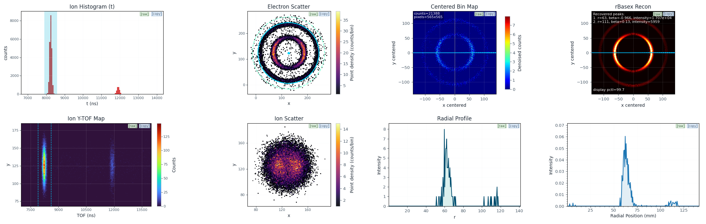

# VMI_workflow



VMI_workflow is an interactive PySide6 workstation for velocity-map imaging
(VMI) photoelectron / photoion coincidence analysis. It takes the coincident
event lists exported by the acquisition software and walks you through the
complete analysis: trigger-based event pairing, ion time-of-flight (TOF)
selection, electron/ion scatter inspection, image-center estimation, polar
projection with noise-subtracted binning, and rBasex Abel inversion (via
[PyAbel](https://github.com/PyAbel/PyAbel)) to recover the radial speed and
angular-anisotropy (beta) distributions. Analysis sessions can be saved and
restored.

## Features

- **Seven-step guided workflow** matching the UI tabs: load data, process and
  plot, ion-histogram ROI and background, coincidence filters and TOF
  alignment, center estimation, ring selection and binning, reconstruction.
- **Two center estimators** — quadrant-symmetry search (default; matches
  diagonal quadrants of the raw scatter points, robust for ring
  distributions, works without any ROI prerequisite) and polar
  outermost-ring fit (straightens the outermost ring inside a user-drawn
  Polar ROI band).
- **Ion-histogram background fitting** — automatic baseline estimation so a
  fine TOF ROI selects signal, not background.
- **Denoised polar binning** — the outer-ring background density is subtracted
  from the centered electron histogram before reconstruction.
- **Asynchronous heavy operations** — file loading, center estimation and
  rBasex reconstruction run on worker threads with a progress bar, keeping the
  UI responsive.
- **Session round trip** — every control state, the computed projections and
  the reconstruction results are saved to `workflow_outputs/` and can be
  restored later.

## Installation

Requires **Python 3.11+**.

```bash
pip install -r requirements.txt
python VMI_workflow.py
```

Optional: install `pyarrow>=15` for roughly 10x faster CSV loading of large
`.dat` triplets. The app auto-detects it and falls back to `numpy.loadtxt`
without it.

```bash
pip install pyarrow
```

## Input data format

The app loads three headerless CSV text files (`.dat`) that the acquisition
export produces — one per detection channel:

| File | Columns | Content |
|---|---|---|
| trigger | 4 | event number, ion TOF (ns), ion index, electron index |
| electron | 3 | x (px), y (px), reserved |
| ion | 3 | x (px), y (px), TOF (ns) |

`NaN` marks a missing channel in an event. Files are matched by the exported
name suffix pattern, e.g. for a run named `run1`:

```
run1_DAn.dat                 (trigger)
run1.lmf_elec_DAn.dat        (electron)
run1.lmf_ion_DAn.dat         (ion)
```

Typical triplets are a few hundred MB each (~10^7 events); with `pyarrow`
installed, ~200-300 MB files load in seconds on a background thread.

## Workflow guide

See **[docs/user-guide.md](docs/user-guide.md)** for a full walkthrough with
screenshots. The short version:

1. **Load** — drop or browse the three `.dat` files, then press `Load`.
2. **Process and Plot** — pick a trigger mode (default `1e+1i` coincidence);
   events are paired and the ion histogram, coincidence map and scatter
   panels are drawn.
3. **Ion Histogram** — set a coarse ROI and a fine ROI around an ion TOF
   peak; the automatic background fit can be enabled to refine the selection.
4. **Ion Coincidence** — inspect the ion TOF vs position map, fit the TOF
   line and apply "align to 0" to straighten the ion distribution.
5. **Electron Scatter** — estimate the image center with the quadrant
   symmetry (default) or polar outermost-ring estimator, then set the ring
   inner/outer radii.
6. **Apply ring selection and bin** — builds the centered, denoised electron
   histogram (outer-ring noise subtracted) and the theta profile.
7. **Reconstruction** — run the rBasex Abel inversion; peaks are reported as
   (radius, beta, intensity).

## Testing

The regression suite pins the scientific numbers on a deterministic synthetic
triplet (fixed RNG seed):

```bash
python tests/test_core.py                                # numerics goldens (~15 s)
QT_QPA_PLATFORM=offscreen python tests/test_smoke.py     # end-to-end UI workflow (~60 s)
```

To regenerate the sample data and golden files (only after an intentional,
reviewed behaviour change — see `tests/README.md`):

```bash
python tests/make_sample_data.py
python tests/test_core.py --update-golden
QT_QPA_PLATFORM=offscreen python tests/test_smoke.py --update-golden
```

## Project layout

```
VMI_workflow.py                 GUI: main window, interactions, workflow orchestration
VMI_workflow_core.py            Pure numpy/scipy numerics (pairing, centers, binning)
VMI_workflow_reconstruction.py  PyAbel rBasex driver + peak extraction
tests/                          Regression suite, sample-data generator, benchmarks
docs/                           User guide (docs/user-guide.md), science reference (docs/science.md) and app screenshots
ARCHITECTURE.md                 Deep-dive documentation: architecture, algorithms, cache design
```

## Notes

- Session saves are written to `workflow_outputs/` next to the current working
  directory.
- Session metadata embeds the absolute paths of the loaded input files, so a
  shared session file reveals the local directory names it was created from.
  Harmless, but worth knowing when passing sessions around.
- `CITATION.cff` currently carries a placeholder repository URL
  (`https://github.com/EXAMPLE/vmi-workflow`); update it (and this note) after
  the public repository is created.

## License

[MIT](LICENSE)
