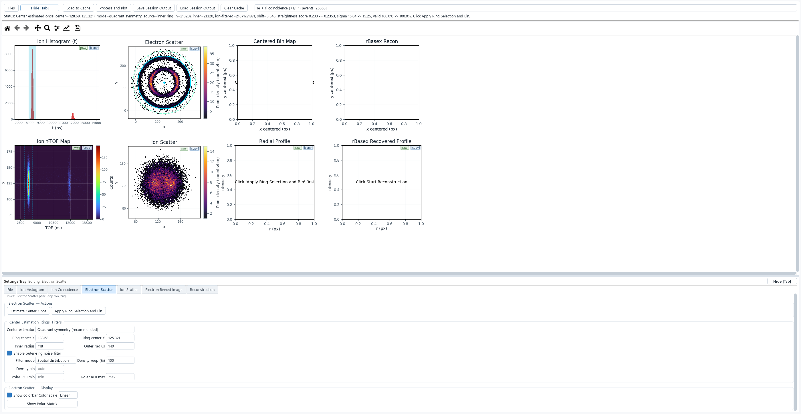
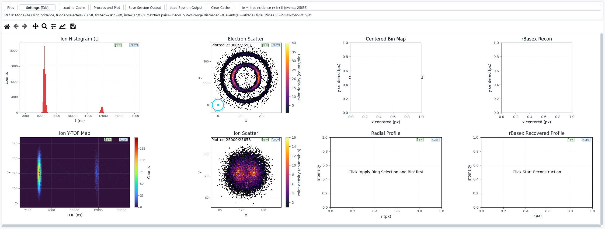
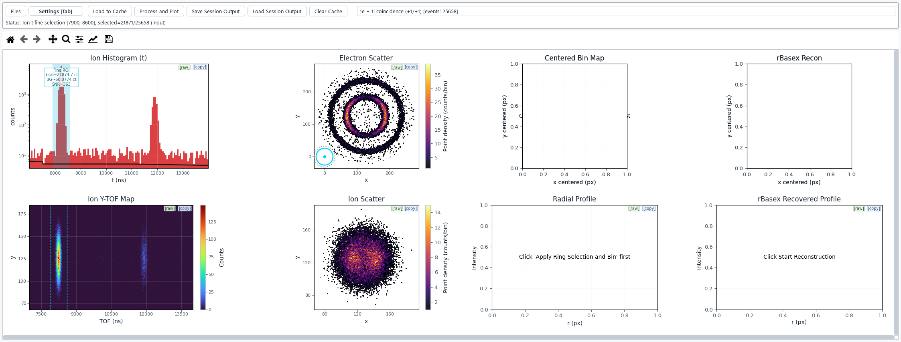
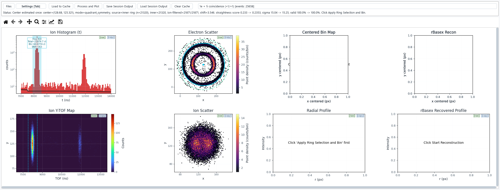
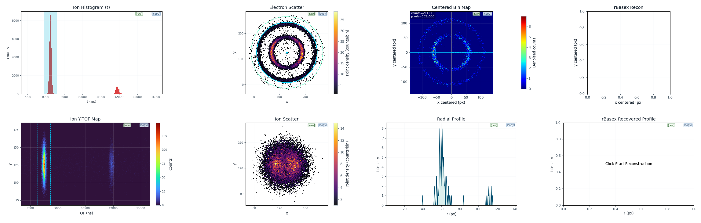
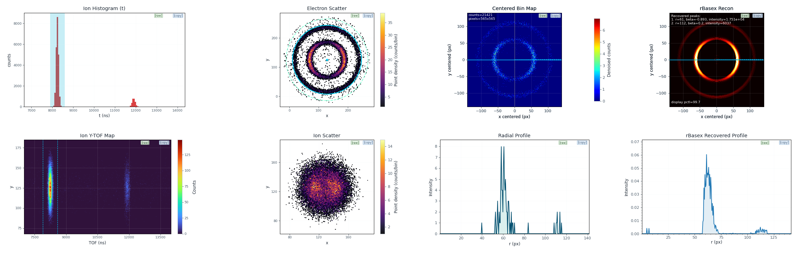

# VMI_workflow User Guide

A practical walkthrough of the VMI_workflow application: from three raw
coincidence `.dat` files to Abel-inverted photoelectron distributions
(radius, anisotropy beta, intensity).

Everything in this guide uses the labels exactly as they appear in the user
interface. Screenshots were produced with the deterministic sample triplet
shipped in `tests/sample_data/` (a synthetic Ar+ VMI measurement with two
Newton-sphere rings), so you can reproduce every figure yourself.

---

## Table of contents

1. [Overview](#1-overview)
2. [Getting started](#2-getting-started)
3. [The workflow, step by step](#3-the-workflow-step-by-step)
   - [Step 1 — Load the files](#step-1--load-the-files)
   - [Step 2 — Process and Plot (trigger modes)](#step-2--process-and-plot-trigger-modes)
   - [Step 3 — Ion Histogram: ROI, peaks, m/q, background](#step-3--ion-histogram-roi-peaks-mq-background)
   - [Step 4 — Ion Coincidence: TOF map, background model, alignment](#step-4--ion-coincidence-tof-map-background-model-alignment)
   - [Step 5 — Electron Scatter: center estimation and rings](#step-5--electron-scatter-center-estimation-and-rings)
   - [Step 6 — Ion Scatter: ion filter, rotation, TOF centering](#step-6--ion-scatter-ion-filter-rotation-tof-centering)
   - [Step 7 — Electron Binned Image + Reconstruction](#step-7--electron-binned-image--reconstruction)
   - [Step 8 — Sessions: save, restore, share](#step-8--sessions-save-restore-share)
4. [Interaction reference](#4-interaction-reference)
5. [Tips and troubleshooting](#5-tips-and-troubleshooting)

---

## 1. Overview

VMI_workflow is an interactive workstation for velocity-map-imaging (VMI)
photoelectron / photoion coincidence analysis. It takes the event lists
exported by your acquisition software and walks you through the complete
analysis: trigger-based event pairing, ion time-of-flight (TOF) selection,
electron/ion scatter inspection, image-center estimation, polar projection
with noise-subtracted binning, and the rBasex Abel inversion (via
[PyAbel](https://github.com/PyAbel/PyAbel)) that recovers the radial speed
distribution and the angular-anisotropy (beta) parameters.

### The 2x4 dashboard

After **Process and Plot** the main window shows a 2x4 grid of live panels:

| Row | Panels (left to right) |
|---|---|
| Top | **Ion Histogram** — ion TOF (or m/q) histogram with coarse/fine ROI shading, peak markers and the fitted background curve. **Electron Scatter** — raw electron detector positions of the selected coincidences (the Newton spheres), with the ring-selection circle overlay. **Centered Bin Map** — the electron image after recentering and binning, with the outer-ring background density subtracted. **rBasex Recon** — the Abel-inverted image with the recovered-peak annotation. |
| Bottom | **Ion X/Y-TOF Map** — ion detector coordinate versus TOF density map (the elongated blobs show how the ion position drifts with TOF; this is what the alignment straightens). **Ion Scatter** — raw ion detector positions, with the rectangular ion filter overlay. **Radial Profile** — theta-slice (or angular-integrated) radial profile of the centered image. **Radial Position (mm)** — radial profile of the rBasex reconstruction, optionally on kinetic-/binding-energy axes. |

Every panel carries two small buttons in its top-right corner: **[copy]**
copies the panel image to the clipboard and **[raw]** saves the underlying
data bundle to a file.

### Philosophy

- **Interactive workflow.** The seven analysis steps map one-to-one onto the
  seven tabs of the *Settings Tray*; every change redraws the affected
  panels immediately, so you steer the analysis rather than editing scripts.
- **Session round trip.** *Save Session Output* writes every control state,
  all computed projections and the reconstruction result to
  `workflow_outputs/`; *Load Session Output* restores it later — results are
  viewable without re-running the pipeline.

---

## 2. Getting started

### Installation

Requires **Python 3.11+**.

```bash
pip install -r requirements.txt
python VMI_workflow.py
```

Optional but recommended for real data:

```bash
pip install pyarrow
```

With `pyarrow>=15` installed the CSV loader is roughly 10x faster; without it
the app silently falls back to `numpy.loadtxt` (identical results, slower).

### Input data format

The app loads **three headerless CSV text files** (`.dat`), one per detection
channel, produced by the acquisition export:

| File | Columns | Content |
|---|---|---|
| trigger | 4 | event number, ion TOF (ns), ion index, electron index |
| electron | 3 | x (px), y (px), reserved |
| ion | 3 | x (px), y (px), TOF (ns) |

`NaN` marks a missing channel in an event (e.g. an ion-only trigger).

Files are matched by the exported name suffix pattern. For a run named
`run1`:

```
run1_DAn.dat                 (trigger)
run1.lmf_elec_DAn.dat        (electron)
run1.lmf_ion_DAn.dat         (ion)
```

Realistic triplets are large: **100-300 MB per file** (tens of millions of
rows). With `pyarrow` installed such files load in seconds on a background
thread; the progress bar in the status row tracks each file.

---

## 3. The workflow, step by step

The top bar always shows, left to right:

> **Files** | **Settings [Tab]** | *Target: \<tab\>* | **Load to Cache** |
> **Process and Plot** | **Save Session Output** | **Load Session Output** |
> **Clear Cache** | **Data loading mode** \<dropdown\>

Below it, a status row shows the current status text and (during heavy
operations) a progress bar. The **Settings Tray** below the plot area holds
the seven tabs — press **Tab** while the plot area has focus (or click
**Settings [Tab]**) to show/hide it.



### Step 1 — Load the files

Open the **File** tab (or click **Files**). The **File Sources** box has
three drop frames — **Trigger File**, **Electron File**, **Ion File**.
Drag a file onto a frame or click it to browse. Registering a file
invalidates any existing cache ("File changed. Cache invalidated, please
load again.").

Then press **Load to Cache** in the top bar. Loading runs on a worker thread
with a progress bar; the status text reports each file. When it finishes,
the **Data loading mode** dropdown labels update with event counts, e.g.
`1e + 1i coincidence (+1/+1) [events: 25568]` (they show
`[events: n/a]` before data is loaded).

### Step 2 — Process and Plot (trigger modes)

Pick the **Data loading mode** and press **Process and Plot**. The mode
decides how trigger rows are converted into electron/ion pairs:

| Mode | Meaning |
|---|---|
| `1e + 1i coincidence (+1/+1)` | Keep a row only when it is exactly +1/+1 relative to the immediately previous row: one electron and one ion from the same ionization event. The cleanest electron-ion coincidence selection. |
| `1e + 2i coincidence (+1/+2, keep both ions)` | Keep a row only when it is exactly +1/+2 vs the previous row and emit both ions (i-1 and i): one electron coincident with two ions (e.g. dissociation into two charged fragments). |
| `1e + 3i coincidence (+1/+3, keep three ions)` | Same idea with +1/+3; emits three ions (i-2, i-1, i). |
| `All valid trigger rows (drop NaN)` | Keep every non-NaN trigger row with no coincidence filter. Startup default; useful for a first look at the ion histogram. |

**Process and Plot** fills the ion histogram, the Ion X/Y-TOF Map and both
scatter panels (subsampled to at most 25,000 plotted points per scatter for
responsiveness, with a "Plotted 25000/25658" badge).



### Step 3 — Ion Histogram: ROI, peaks, m/q, background

Switch to the **Ion Histogram** tab. Controls are split into a **Controls**
box, a **Display** box and the histogram panel.

1. **Coarse ROI — Hist X ROI.** Type **Hist X ROI min** / **Hist X ROI max**
   (ns, or m/q if the m/q axis is on) and press **Update Hist ROI** (Enter in
   the fields works too). This zooms the histogram x-range. **Reset Hist X
   ROI** returns to full.
2. **Fine ROI.** Either drag a horizontal span directly on the histogram
   (the shaded blue span, debounced) or type **Fine ROI min** / **Fine ROI
   max** and press **Update Fine ROI**. Only events inside the fine ROI feed
   the scatter panels and everything downstream. The status line above the
   fields reports the current selection; **Clear Fine ROI** removes it.
   After a fit, an annotation on the panel reports
   `Fine ROI Total/BG/SNR` counts.
3. **Peak markers.** **Ctrl+click** on the histogram adds a manual marker
   line/label, **double-click** on a marker removes it, **Clear markers**
   removes all.
4. **m/q reference calibration.** Tick **Histogram X axis = m/q (use ref
   below)** and fill **Ref m/q** (e.g. 40) plus **Ref TOF center (ns)**;
   **Take Fine ROI as Ref TOF** copies the current fine-ROI center into the
   reference. The axis uses the quadratic time-of-flight law
   `m/q = a * t^2` anchored at your reference; an optional **Ref TOF range
   (ns)** refines the fit by least squares over that window. **Y axis log
   scale** and **Normalize to peak** (with an optional **Norm ref peak** /
   **Use Fine ROI as Norm Ref**) control the y display.
5. **Background fitting.** The flat red baseline under the histogram is
   background (false coincidences). The **BG law** dropdown offers
   **Adaptive variable-slope** (default; fits a smooth envelope of 1-2 power
   components — use it when you do not know the decay shape) or fixed laws
   (`Power law 1/m^p`, `1/sqrt(m)`, `1/m`) when you know the physical decay.
   **BG fit mode** picks **Auto 1-2**, **1 curve** or **2 curves**;
   **BG fit domain** fits on the **Displayed axis** or in the **TOF domain**
   (relevant when the m/q axis is on). Press **Fit BG Curve**; the fitted
   curve overlays the histogram, the fine-ROI annotation gains its
   `BG=… SNR=…` numbers, and the result label reports the fit. **Clear BG
   Fit** removes it. The background fit also refines the fine-ROI selection:
   signal is judged against the fitted baseline, not raw counts.



### Step 4 — Ion Coincidence: TOF map, background model, alignment

The **Ion Coincidence** tab works on the **Ion X/Y-TOF Map** (bottom-left
panel): ion detector coordinate (Y by default; **Y axis** combo switches to
X) versus TOF, colored by counts (**Count scale** Linear/Log/Exponential,
**TOF bin**/**Coord bin**, **TOF ROI min/max**).

- **What the map shows:** each ion species is a slanted stripe — the ion
  hits the detector at a position that drifts with TOF. A slanted stripe
  means the later analysis (e.g. rectangular ion filtering) has to chase a
  moving target; aligning it to horizontal fixes that.
- **TOF background model.** First mark signal regions with **Pick Boxes on
  Plot**: click the lower-left corner then drag/click the upper-right corner
  of a rectangle (double-click inside a box removes it). Then
  **BG Uses Fit Boxes** becomes the background source: press **Fit BG
  Model**, which uses the points *outside* the stored boxes as background
  examples and fits a smoothed XY-density + radial-floor model. Tick
  **Enable BG subtraction** to drop the points classified as background from
  the raw ion set. **Clear BG** resets everything.
- **TOF alignment.** With fit boxes picked (or just a TOF window via **Fit
  TOF min/max** and **Fit coord min/max**), press **Fit Main Axis**: the app
  finds the dense ridge inside the selection and fits a robust straight
  line. **Apply Align to 0** subtracts that line from the displayed
  coordinate so the stripe becomes horizontal (the map redraws straightened).
  **Clear Align** undoes it. The result label shows the fitted line
  parameters.

### Step 5 — Electron Scatter: center estimation and rings

The **Electron Scatter** tab (shown in the Settings-Tray screenshot above)
controls the most important geometric step.

- **Center estimation — the two methods.** The **Center estimator** dropdown
  offers exactly two methods:
  1. **Quadrant symmetry (recommended)** — default. Matches diagonal
     quadrants of the raw scatter points against each other (180-degree
     rotation symmetry) and picks the center that makes the quadrants most
     congruent. Robust for ring (Newton-sphere) distributions and needs **no
     prerequisites** — use it first, always.
  2. **Polar outermost ring line** — straightens the outermost Newton-sphere
     ring in a polar (theta-vs-r) view. **Requires a Polar ROI band first**:
     press **Show Polar Matrix** to switch the electron panel to the
     theta-vs-r matrix, then **left-drag vertically** inside it to set the
     band (or type **Polar ROI min** / **Polar ROI max**). Use this method
     when the outermost ring is clean and complete — the quadrant method can
     be biased by a strongly asymmetric outer halo.
  Estimate the center without dialog popups via **Estimate Center Once**;
  the result is written into **Ring center X/Y**. On the first estimate the
  result is always accepted; later re-estimates only replace it when the
  ring-straightness metrics improve.
- **Circle rings.** **Inner radius (signal)** and **Outer radius (noise)**
  define the analysis circle: inner radius must enclose all Newton rings you
  want to keep; the annulus between inner and outer collects the
  out-of-ring noise used for denoising. You can type values, or drag the
  circle center marker (the dot at the middle of the cyan rings) directly on
  the Electron Scatter panel to reposition it.
- **Filters.** **Filter mode** = **Spatial distribution** (default) or
  **Point density** with **Density keep (%)** (keep the top X% densest
  points) and an optional auto or fixed **Density bin**. Density filtering
  removes sparse outlier points before centering.
- **Enable outer-ring noise filter.** Tick this so that
  **Apply Ring Selection and Bin** subtracts the outer-annulus background
  density from the centered image (see Step 7).



### Step 6 — Ion Scatter: ion filter, rotation, TOF centering

The **Ion Scatter** tab limits which ion events define the coincidences.

- **Ion rectangle filter.** Tick **Enable ion filter**, then drag the
  dashed rectangle on the Ion Scatter panel (or edit **Filter center X/Y**,
  **Filter width/height**). Only coincidences whose ion falls inside the
  rectangle are kept downstream. **Filter mode** adds **Point density**
  (keep top **Density keep (%)** densest) and **Point density -> spatial**
  combinations, with **Density bin** and **Density remove M** (drop exactly
  the M sparsest points) for advanced cleanup.
- **Rotation.** **Show Main Direction Line** overlays the dominant ion
  direction; drag on the panel (with the line shown) to rotate live — the
  title shows the preview angle — or use **Rotate Main Direction to
  Horizontal** for a one-shot alignment that also writes **Rotation offset
  (deg)**; **Apply Rotation** applies the typed offset about **Rot center
  X/Y**. **Center Peak + Set Rot Center** moves the densest ion peak to the
  origin and adopts it as the rotation center.
- **TOF centering.** If the ion cloud still smears along one axis, pick
  **TOF fit axis** (`X from X-TOF` / `Y from Y-TOF`) after fitting the
  corresponding axis in the Ion Coincidence tab, then **Apply Temp Center
  Corr** — a display-only shift that flattens the ion cloud for easier
  rectangle selection. **Clear Temp Center Corr** removes it.

### Step 7 — Electron Binned Image + Reconstruction

- **Apply the ring selection.** Press **Apply Ring Selection and Bin** on
  the Electron Scatter tab. The app recenters all selected electrons on the
  circle center, bins them (**Centered bin size**, default 0.5 px) in the
  **Centered Bin Map**, and — with the outer-ring noise filter enabled —
  subtracts the uniform background density measured in the outer annulus
  (`removed total` is reported). The **Radial Profile** panel shows the
  theta slice at **Theta (deg)** with width **dTheta (deg)**
  (**Update Theta Profile**; **Profile mode** switches to an
  angular-integrated 2pi profile, **Radial bin** sets its binning). Dragging
  on the Centered Bin Map or the rBasex panel moves the theta guide line.
  The panel header reports `counts=…  pixels=565x565`.

  

- **Reconstruction parameters.** On the **Reconstruction** tab, the
  **rBasex Model Parameters** box controls the pyAbel rBasex
  inversion: **Order** (basis expansion order, default 2), **Odd terms**
  (include odd beta orders; off by default), **Reg** (regularization,
  blank = None, e.g. 200 for noisy data), **rmax** (`MIN`, `MAX` or an
  integer radius in bins). Peak finding uses **Peak smooth sigma**,
  **Peak height** (0.12), **Peak prominence** (0.08), **Max peaks** (5),
  **Min-dist frac** (0.06); **Display percentile** (99.7) sets the image
  display clipping.
- **Run it.** Press **Start Reconstruction** on the **Reconstruction** tab
  (rBasex — Run box). The inversion runs asynchronously with a
  progress bar; the UI stays responsive. The **rBasex Recon** panel shows
  the inverted image and lists the recovered peaks, one line each:

  ```
  Recovered peaks:
  1. r=61, beta=-0.893, intensity=1.751e+04
  2. r=112, beta=0.2, intensity=6037
  ```

  `r` is the ring radius in mm (bin size x px), `beta` the anisotropy
  parameter of that ring, `intensity` its integrated strength. The bottom
  right panel shows the same information as the radial profile; **Profile r
  tags** (Ctrl+click on the profile or type `10, 15.5`), **X axis** switching
  to **Kinetic Energy (eV)** / **Binding Energy (eV)** via **Energy c**,
  **Energy b**, **Photon hv**, and **Pick Range on Plot** (drag to integrate
  one x-range) are available for quantitative reading.

  

### Step 8 — Sessions: save, restore, share

- **Save Session Output** writes a timestamped folder into
  `workflow_outputs/` next to the current working directory, e.g.
  `workflow_outputs/20260901_142530_synth_ar100_vmi/`:

  ```
  session_metadata.json        every control value, selection state, counts, operation log
  session_data.npz             the computed arrays (projections, recon result)
  rbasex_reconstruction.png    rendered reconstruction image
  preview_ion_histogram.png    preview snapshots of four panels
  preview_ion_tof_xy.png
  preview_electron_scatter.png
  preview_ion_scatter.png
  ```

- **Load Session Output** opens a `session_metadata.json` and restores the
  whole state — controls, center, ROIs, projections and the reconstruction —
  without recomputing. Restoring re-reads the input `.dat` files recorded in
  the metadata.
- **What is stored / sharing.** The metadata embeds the *absolute paths* of
  the loaded input files (and the operation log). That is harmless locally,
  but remember it when passing session folders to colleagues: the paths
  reveal your directory layout, and a session only restores fully where
  those files exist at the recorded paths.
- Sessions saved before a center-estimator change restore cleanly: removed
  estimator names are remapped to the default **Quadrant symmetry**
  estimator on load.

---

## 4. Interaction reference

### Drag gestures on the panels

| Panel | Gesture | Effect |
|---|---|---|
| Ion Histogram | drag horizontally | fine-ROI span; commits after a short debounce (also draggable afterwards to move it) |
| Ion Histogram | Ctrl+click / double-click | add / remove a peak marker |
| Ion X/Y-TOF Map | Pick Boxes on Plot: click corner, drag or click opposite corner | add a fit box (double-click inside a box removes it) |
| Electron Scatter | drag the circle center dot | move ring center (updates **Ring center X/Y**), ~60 fps preview |
| Electron Scatter (polar view) | left-drag vertically | create/move/resize the **Polar ROI** band |
| Ion Scatter | drag inside the dashed rectangle | move the ion filter rectangle |
| Ion Scatter (with main direction line on) | drag | live rotation preview; commits the angle on release |
| Centered Bin Map / rBasex Recon | drag | move the theta guide line (updates **Theta (deg)**) |
| Radial Profile (theta) | click / Ctrl+click | set / add a radius cursor |
| Radial Position (mm) | Pick Range on Plot, then drag | select the integration range (snaps to bins); Ctrl+click adds r tags |
| Any panel | right-click | cancel the active interaction |

### Wheel, keyboard, panel buttons

| Input | Behaviour |
|---|---|
| Mouse wheel over the plot area | fast "burst" scrolling: a cached snapshot of the canvas scrolls instantly, the live figure catches up when the wheel settles (coalesced every ~12 ms). Shift+wheel prefers horizontal scrolling in scroll areas. |
| **Tab** (plot area focused) | shows/hides the Settings Tray. |
| **[copy]** button on each panel | copies that panel's image to the system clipboard. |
| **[raw]** button on each panel | saves the panel's underlying data bundle to a file. |
| Typing filter/ROI values | applied live with a ~70-80 ms debounce per edit; drag gestures preview at up to 60 Hz. |

---

## 5. Tips and troubleshooting

**The first reconstruction is slow.**
The first rBasex run generates and writes the Abel basis set to
`~/.cache/vmi_workflow/abel_basis`; every later run (same or new session)
reuses it and starts in milliseconds. If a reconstruction ever seems to
hang on the very first run, it is most likely building this basis once.

**Typing feels laggy / instant.**
Filter, radius and ROI fields are debounced (~70-80 ms) and drag overlays
are throttled to a 60 Hz blit preview; final values are committed on
release or after the debounce. Nothing is lost by typing quickly.

**Old sessions with removed center modes.**
Sessions saved when the app offered five center estimators restore
without errors: any removed mode (`edge_fit`, `centroid`, `geo_median`,
historic `polar_peak`) is remapped to **Quadrant symmetry (recommended)**;
`Polar outermost ring line` restores as itself.

**Sharing sessions.**
`session_metadata.json` stores absolute input-file paths. When you send a
session to someone else, either keep the `.dat` triplet at the same
absolute path or expect the restore to ask for the files.

**Common issues**

| Symptom | Cause / fix |
|---|---|
| `ImportError: abel` / reconstruction disabled | pyabel missing — `pip install pyabel` (see `requirements.txt`). |
| Qt platform plugin errors (e.g. `offscreen` or `xcb` complaints) | headless servers need `QT_QPA_PLATFORM=offscreen`; remote Linux boxes may need `libxcb`/`libEGL` packages or `QT_QPA_PLATFORM=minimum`. |
| Loading a 200 MB `.dat` takes a minute or more | pyarrow not installed — `pip install pyarrow` for the ~10x faster CSV reader. The fallback path is correct but slower. |
| Electron Scatter looks empty | no coincidence pairs survived the trigger mode / fine ROI / ion filter chain; check the status bar ("No selected points" annotation) and widen the fine ROI or disable the ion filter. |
| Center estimate looks wrong | set a sensible manual center first (the estimator uses it as the starting guess), keep the inner radius just beyond the outermost ring, and try the **Polar outermost ring line** method with a clean Polar ROI band. |
| Scatter panels only show 25,000 points | that is the intentional display cap for responsiveness (`Plotted 25000/25658`); all computations use the full selection. |
| Histogram background fit follows the signal peaks | switch **BG fit mode** to **1 curve**, or choose a fixed **BG law** and a **TOF domain** fit so the baseline cannot climb into the peaks. |
| Reconstruction results change between runs | ensure the centered image did not change (any change to fine ROI, filters, center, radii, bin size invalidates it) and that **Order/Odd/Reg/rmax** are as intended; r and beta values are reproducible for identical inputs. |

---

*Documentation index: [README](../README.md) · [ARCHITECTURE.md](../ARCHITECTURE.md) · this guide.*
